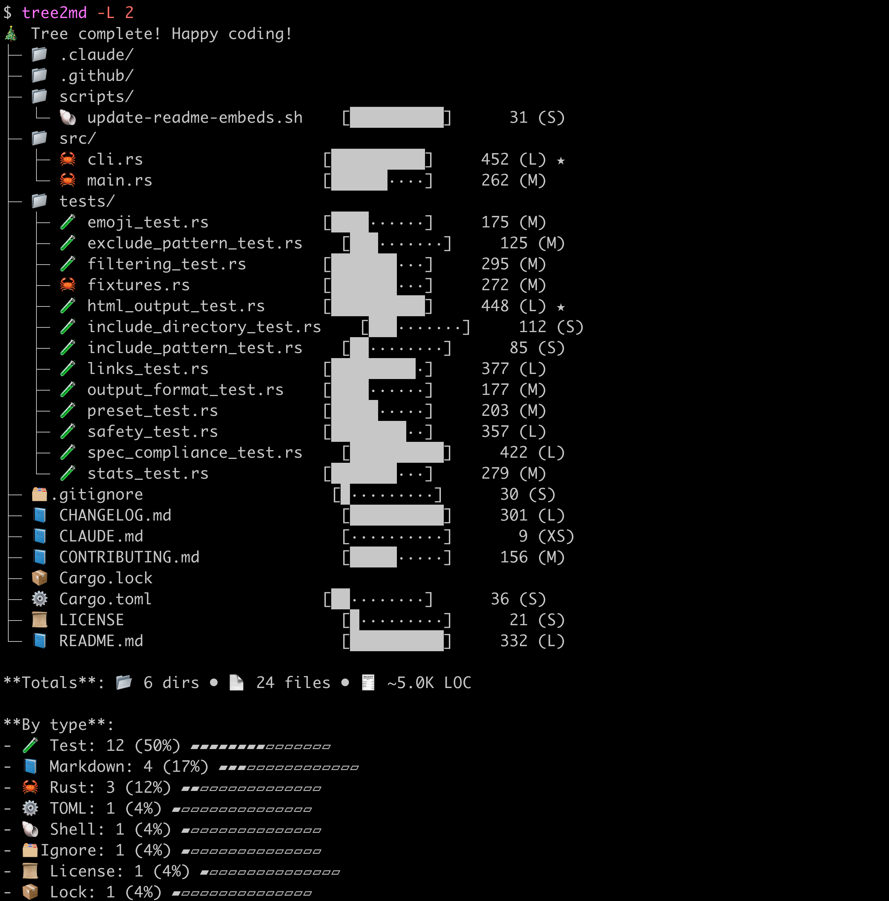

# tree2md

[](https://crates.io/crates/tree2md)
[](https://opensource.org/licenses/MIT)

**📁 Generate beautiful tree structures in Markdown, HTML, or Terminal format**

```bash
tree2md                                                          # Pretty terminal tree with colors & bars
tree2md --github https://github.com/you/repo --inject README.md  # Auto-update your docs with one command!
```

Transform your project structure into stunning visualizations — from colorful terminal trees with progress bars to GitHub-ready documentation with clickable links. Perfect for READMEs, architecture docs, and code reviews.



---

## 🎯 Key Features

* **🎨 Multiple Output Formats** — Markdown, HTML with collapsible folders, or Terminal tree
* **🔗 GitHub Integration** — Automatic link rewriting for clickable GitHub navigation
* **🔒 Safe by Default** — Auto-excludes `.env`, secrets, `node_modules/`, `.git/` and more
* **📊 Rich Statistics** — File counts, extensions breakdown, lines of code with visual bars
* **📝 README Injection** — Update README.md between tags automatically (idempotent)
* **⚡ Smart Presets** — `--preset readme` for docs, `--preset fun` for emojis & animations

---

## 📥 Installation

### From crates.io

```bash
cargo install tree2md

# Your Git Repository
tree2md
```

### From source

```bash
git clone https://github.com/zawakin/tree2md
cd tree2md
cargo install --path .
```

### Pre-built binaries

Download from [GitHub Releases](https://github.com/zawakin/tree2md/releases)

---

## 🚀 Quick Start

```bash
# Beautiful terminal tree with progress bars and file sizes
tree2md                          # Auto-detects terminal for colorful output!
tree2md --preset fun             # With emojis and animations 🎉

# Save as Markdown with full statistics
tree2md --preset readme > STRUCTURE.md

# Auto-inject into README with GitHub links
tree2md --github https://github.com/you/repo/tree/main --inject README.md

# HTML output with collapsible folders
tree2md --output html --fold auto > tree.html

# Focus on specific files (e.g., only Rust files, max 3 levels)
tree2md src/ -L 3 -I "*.rs" --stats full
```

---

## 📋 Example Output

```markdown
- src/
  - [cli.rs](src/cli.rs) (452 lines)
  - [main.rs](src/main.rs) (262 lines)
- tests/
  - [emoji_test.rs](tests/emoji_test.rs) (175 lines)
  - [filtering_test.rs](tests/filtering_test.rs) (295 lines)
  - [safety_test.rs](tests/safety_test.rs) (357 lines)
- [Cargo.toml](Cargo.toml) (36 lines)
- [LICENSE](LICENSE) (21 lines)
- [README.md](README.md) (310 lines)

**Totals**: 📂 2 dirs • 📄 8 files • 🧾 ~1.7K LOC

**By type**:
- Test: 3 (38%) ######---------
- Rust: 2 (25%) ####-----------
- Markdown: 1 (13%) ##-------------
- TOML: 1 (13%) ##-------------
- License: 1 (13%) ##-------------
```

---

## 🛠️ CLI Options

### Filtering

* `-L, --level <N>` — Limit traversal depth
* `-I, --include <GLOB>` — Include patterns (repeatable)
* `-X, --exclude <GLOB>` — Exclude patterns (repeatable)
* `--use-gitignore {auto|never|always}` — Respect `.gitignore`

### Links & Output

* `--links {on|off}` — Toggle Markdown links
* `--github <URL>` — Rewrite links to GitHub
* `--fold {auto|on|off}` — Collapsible folders
* `--no-stats` — Hide stats footer

### Safety

* `--safe` (default) — Excludes sensitive files
* `--unsafe` — Disable all safety filters
* `--restrict-root <DIR>` — Prevent traversal outside root

### README Integration

* `--inject <FILE>` — Update README.md between tags
* `--tag-start <STR>` — Custom start tag (default: `<\!-- tree2md:start -->`)
* `--tag-end <STR>` — Custom end tag (default: `<\!-- tree2md:end -->`)
* `--dry-run` — Preview without writing

### Metadata

* `--stamp {version|date|commit|none}` — Add generation metadata
* `--stamp-date-format <FMT>` — Date format

---

## 🔒 Safety Defaults

Excluded by default:

* `.env`, `.ssh/**`, `*.pem`, `*.key`
* `node_modules/`, `target/`, `dist/`, `build/`
* `.git/**`, `.DS_Store`, `Thumbs.db`

Use `-I` to selectively include, or `--unsafe` to disable filters.

---

## 📝 Common Use Cases

**README injection**

```bash
tree2md . --github https://github.com/you/repo/tree/main --inject README.md
```

**Docs / Architecture**

```bash
tree2md src --fold on > docs/ARCHITECTURE.md
```

**Code reviews**

```bash
tree2md . -L 3 -I "*.rs" -I "*.toml" --no-stats
```

**CI/CD auto-update**

```bash
tree2md . --github $GITHUB_URL --inject README.md --stamp version
git add README.md
git commit -m "Update structure"
```

---

## ⚡ Performance

* **Fast** — Parallel traversal with efficient filtering
* **Memory safe** — Streams output, no huge buffers
* **Deterministic** — Always the same result for same input
* **Git-aware** — Respects `.gitignore`

---

## 🏗️ Build from Source

```bash
git clone https://github.com/zawakin/tree2md
cd tree2md
cargo build --release
cargo test
```

---

## 🤝 Contributing

PRs welcome! See [CONTRIBUTING.md](CONTRIBUTING.md).

For development:

```bash
cargo fmt
cargo clippy -- -D warnings
```

---

## 📂 Project Structure

### Markdown-Style

```bash
tree2md -L 2 . --output md --inject README.md --tag-start '<tag-start>' --tag-end '<tag-end>'
```

````markdown
<!-- tree2md-md:start -->
- .claude/
- .github/
- scripts/
  - [update-readme-embeds.sh](scripts/update-readme-embeds.sh) (28 lines)
- src/
  - [cli.rs](src/cli.rs) (452 lines)
  - [main.rs](src/main.rs) (262 lines)
- tests/
  - [emoji_test.rs](tests/emoji_test.rs) (175 lines)
  - [exclude_pattern_test.rs](tests/exclude_pattern_test.rs) (125 lines)
  - [filtering_test.rs](tests/filtering_test.rs) (295 lines)
  - [fixtures.rs](tests/fixtures.rs) (272 lines)
  - [html_output_test.rs](tests/html_output_test.rs) (448 lines)
  - [include_directory_test.rs](tests/include_directory_test.rs) (112 lines)
  - [include_pattern_test.rs](tests/include_pattern_test.rs) (85 lines)
  - [links_test.rs](tests/links_test.rs) (377 lines)
  - [output_format_test.rs](tests/output_format_test.rs) (177 lines)
  - [preset_test.rs](tests/preset_test.rs) (203 lines)
  - [safety_test.rs](tests/safety_test.rs) (357 lines)
  - [spec_compliance_test.rs](tests/spec_compliance_test.rs) (422 lines)
  - [stats_test.rs](tests/stats_test.rs) (279 lines)
- [.gitignore](.gitignore) (30 lines)
- [CHANGELOG.md](CHANGELOG.md) (252 lines)
- [CLAUDE.md](CLAUDE.md) (9 lines)
- [Cargo.lock](Cargo.lock)
- [Cargo.toml](Cargo.toml) (36 lines)
- [LICENSE](LICENSE) (21 lines)
- [README.md](README.md) (310 lines)

**Totals**: 📂 6 dirs • 📄 23 files • 🧾 ~4.7K LOC

**By type**:
- Test: 12 (52%) ########-------
- Rust: 3 (13%) ##-------------
- Markdown: 3 (13%) ##-------------
- License: 1 (4%) #--------------
- TOML: 1 (4%) #--------------
- Shell: 1 (4%) #--------------
- Ignore: 1 (4%) #--------------
- Lock: 1 (4%) #--------------

<!-- tree2md-md:end -->
````

### Tree(tty)-Style

```bash
tree2md -L 2 . --output tty --inject README.md --tag-start '<tag-start>' --tag-end '<tag-end>'
```


````
<!-- tree2md-tree:start -->
|-- .claude/
|-- .github/
|-- scripts/
|   `-- update-readme-embeds.sh        [██████████]      28 (S)
|-- src/
|   |-- cli.rs                         [██████████]     452 (L) ★
|   `-- main.rs                        [██████····]     262 (M)
|-- tests/
|   |-- emoji_test.rs                  [████······]     175 (M)
|   |-- exclude_pattern_test.rs        [███·······]     125 (M)
|   |-- filtering_test.rs              [███████···]     295 (M)
|   |-- fixtures.rs                    [███████···]     272 (M)
|   |-- html_output_test.rs            [██████████]     448 (L) ★
|   |-- include_directory_test.rs      [███·······]     112 (S)
|   |-- include_pattern_test.rs        [██········]      85 (S)
|   |-- links_test.rs                  [█████████·]     377 (L)
|   |-- output_format_test.rs          [████······]     177 (M)
|   |-- preset_test.rs                 [█████·····]     203 (M)
|   |-- safety_test.rs                 [████████··]     357 (L)
|   |-- spec_compliance_test.rs        [██████████]     422 (L)
|   `-- stats_test.rs                  [███████···]     279 (M)
|-- .gitignore                         [█·········]      30 (S)
|-- CHANGELOG.md                       [█████████·]     252 (M)
|-- CLAUDE.md                          [··········]       9 (XS)
|-- Cargo.lock
|-- Cargo.toml                         [██········]      36 (S)
|-- LICENSE                            [█·········]      21 (S)
`-- README.md                          [██████████]     310 (L)

**Totals**: 📂 6 dirs • 📄 23 files • 🧾 ~4.7K LOC

**By type**:
- Test: 12 (52%) ########-------
- Rust: 3 (13%) ##-------------
- Markdown: 3 (13%) ##-------------
- Lock: 1 (4%) #--------------
- Shell: 1 (4%) #--------------
- TOML: 1 (4%) #--------------
- Ignore: 1 (4%) #--------------
- License: 1 (4%) #--------------

<!-- tree2md-tree:end -->
````


---

## 📄 License

MIT License — see [LICENSE](LICENSE).

---

## 🙏 Acknowledgments

Inspired by the classic `tree` command, designed for Markdown & GitHub integration.

Made with ❤️ for the open source community.
